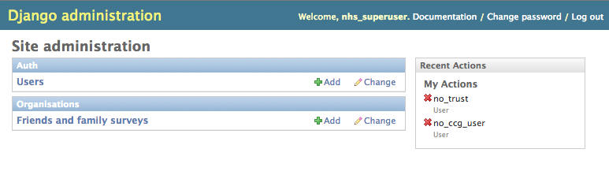
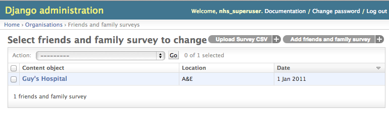
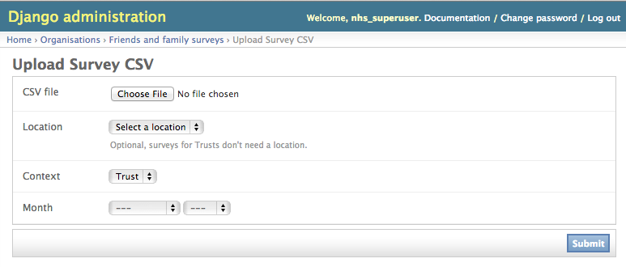
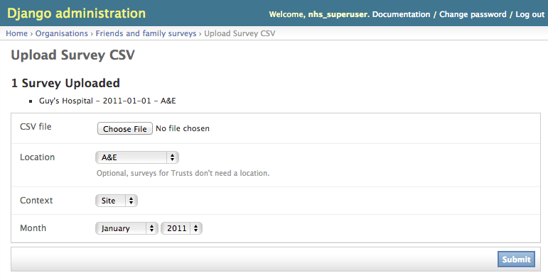
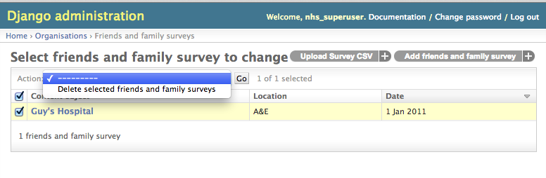
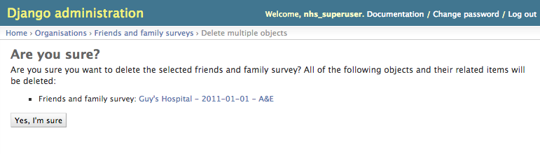

Uploading Survey CSV files using the Django Admin
=================================================

Surveys of the "Friends and Family Test" can be uploaded to the site using a
special page on the Django admin site. This allows spreadsheets of the survey
results for multiple sites to be uploaded in one go, for a given month (and
optionally, a given ward).

CSV Formats
-----------
The site expects the survey CSV's to be uploaded in one of the following
formats:

- [Sites](../organisations/tests/fixtures/fft_survey_trust.csv)
- [Trusts](../organisations/tests/fixtures/fft_survey_trust.csv)

Note that these are taken from the sample Excel file we were given, and many
of the fields are therefore ignored.

The Uploading Process
---------------------
1. Login to the Django admin
    
2. Select "Friends and family surveys" from the homepage
    
3. Click "Upload Survey CSV" in the top right
    
4. Fill out the form
    1. Select a CSV file
    2. Select a location if you're uploading surveys for Sites (leave it empty
    if you're uploading surveys for Trusts)
    3. Choose the context (Site or Trust)
    4. Select a month and year from the dropdowns
    5. Click "Submit"
5. See the results
    

Possible errors
---------------
The form should show you if there's anything wrong with the file you upload or
the selections you make, and if it does, **none** of the data in the file will
have been saved to the database.

To reiterate that: **you must fix all the errors in the file/form before it will
save any of it**.

### An organisation or trust in your CSV doesn't exist
The error message should show you which org/trust is the problem, double check
its' code column is correct (this is how the code identifies it) and that it
is in the site. If it's not in the site currently, you'll need to remove that
row from the CSV.

### You didn't pick a location for a site CSV
The form should tell you this, so you can correct the field - remember to
re-attach the CSV file.

### Your CSV is missing some required columns, or the numbers in the columns are bad.
The form identifies columns by name, so double-check that they are the same as
in the example files linked above. Also check that any fields which have
commas in are quoted with "" quote marks so as not to confuse it about where a
column starts.
If the names look correct, double check the data too - there must be a value
in the overall column and a value in each of the response type columns (
Likely, Unlikely, etc). In addition, those values must be a positive number or
0.

### You've already uploaded a CSV for this Context/Month/Location combination.
The system only allows one survey for each org/trust per month (per month, per
ward for orgs). Rather than replacing the existing one automatically, if you
upload a duplicate it will refuse to process it. If you really do want to
replace a survey, you have to delete the existing one first:

1. Go back to the Friends and family surveys page
2. Find and select the survey you want to delete from the list
3. Select "Delete selected Friends and family survey" from the "Action" dropdown at the top of the list and hit "Go".
    
4. Check and confirm your action on the "Are you sure" page
    
